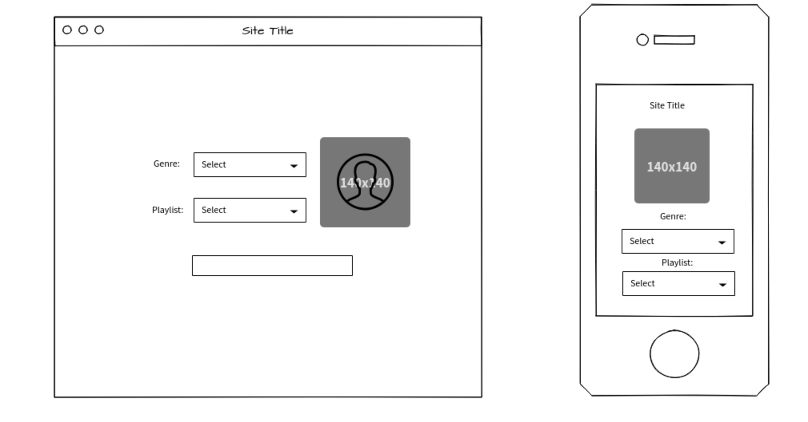
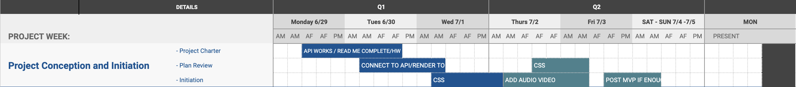

# Underground Sound


## Project #2 - Overview 

- **App Description**: The concept of this application to highlight underground rap music.

### OUR WHY
To showcase a broder range of talent that often doesn't get depicted by mainstream outlets. To bring a diverse array of artists to the forfront. 

## API and Data Sample

https://api.spotify.com/v1/search?query=underground_rappers&type=track,artist&market=US&offset=5&limit=10

``` JSON {
  "artists": {
    "href": "https://api.spotify.com/v1/search?query=underground_rappers&type=artist&market=US&offset=5&limit=10",
    "items": [],
    "limit": 10,
    "next": null,
    "offset": 5,
    "previous": "https://api.spotify.com/v1/search?query=underground_rappers&type=artist&market=US&offset=0&limit=10",
    "total": 0
  },
  "tracks": {
    "href": "https://api.spotify.com/v1/search?query=underground_rappers&type=track&market=US&offset=5&limit=10",
    "items": [
      {
        "album": {
          "album_type": "album",
          "artists": [
            {
              "external_urls": {
                "spotify": "https://open.spotify.com/artist/02rRRxxYhqnItQOqmR6eDu"
              },
              "href": "https://api.spotify.com/v1/artists/02rRRxxYhqnItQOqmR6eDu",
              "id": "02rRRxxYhqnItQOqmR6eDu",
              "name": "Havoc Savage",
              "type": "artist",
              "uri": "spotify:artist:02rRRxxYhqnItQOqmR6eDu"
            }
```

## Wireframes

https://wireframepro.mockflow.com/view/M5dd55722a1f547f35bf44b79cb69b7c11593471119485

- **MVP**: 

- Find and use external Api 
- Render Data to webpage: Artist Name, Album Title, Album Cover Art 
- Render using React 


- **Post-MVP**: 

- Play Audio of song track(s)
- Play Video

- **Goals**: What you plan to accomplish for each day of the project week.

## Project Schedule

|  Day | Deliverable | Status
|---|---| ---|
|June 29| Found Api / Created Reated Readme | Incomplete
|June 30| Contect to Api and Render to DOM / Priority Matrix / Timeframes | Incomplete
|July 1| Core Application Structure (HTML, CSS, etc.) | Incomplete
|July 2-3| Initial Clickable Model  | Incomplete
|July 5| MVP | Incomplete
|July 6| Present | Incomplete



- **Priority Matrix**: A graph of your intended areas of development (Pseudocoding, Design, HTML, CSS, JavaScript, Testing, etc) plotted on an X/Y axis where X represents time to completion and Y represents priority.


|  Priority | Matrix Status | 
|---|---|
|BLUE| High Priority 
|GREEN| Medium Priority




- **Timeframes**: 

| Component | Priority | Estimated Time | Time Invested | Actual Time |
| --- | :---: |  :---: | :---: | :---: |
| HTML Structure | M | 2hrs| 3hrs | 3hrs |
| Adding Form | H | 2hrs | 4hrs | 4hrs|
| Working with API | H | 3hrs| 9hr | 9hrs |
| Sort thru data | H | 4hrs| 7hrs | 7hrs |
| Adding CSS | H | 30hrs| 12hrs | 12hrs |
| Total | H | 41hrs| 35hrs | 35hrs |


## Code Snippet

Very proud of this code because with out it, I wouldn't be able to access the api. 

```
const base64credentials = btoa(client_id + ':' + client_secret)
const OauthResponse = await axios.post(OauthUrl, 'grant_type=client_credentials',
      {
        headers: {
          'content-type': 'application/x-www-form-urlencoded',
          Authorization: `Basic ${base64credentials}`,
        }
      })
    // Extract the accesss token from the response body
    const token = OauthResponse.data.access_token
    // Make a request to ge the data from Spotify using the access token just obtained.
    const response = await axios.get(apiUrl, { headers: { Authorization: `Bearer ${token}` } })


```

## Change Log
- What I had to pivot, styling and not having enough time to add more data. 
- Would like to learn how to access other user's personal playlist to create a more robust app full of a variety of content. People is the gold. They are the music and add diversity to the landscape.  

## SWOT Analysis: 
- Strength: Have a great support system and plenty of resources. 

- Weakness: Not knowing React as well as I would like. 

- How will you overcome your weaknesses and threats? Ugh only the lord knows.
- Acknowledgement and transparency. 
- Asking for help.  
